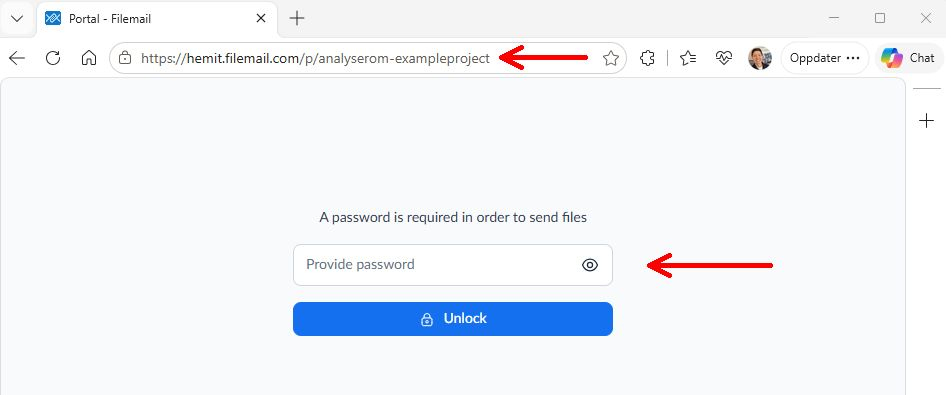
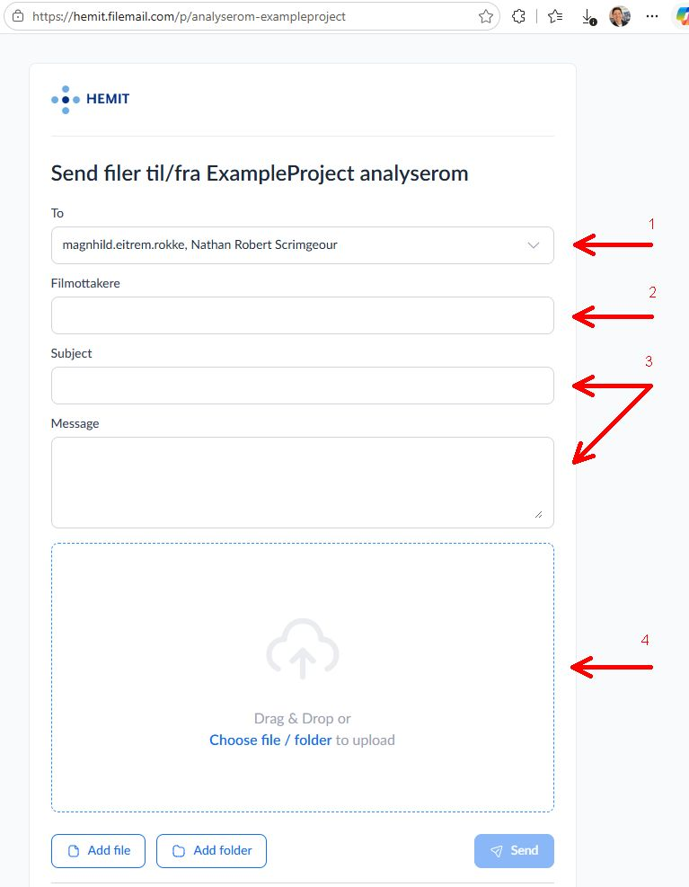
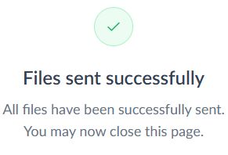
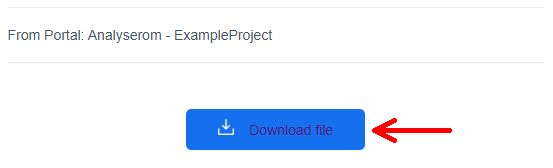
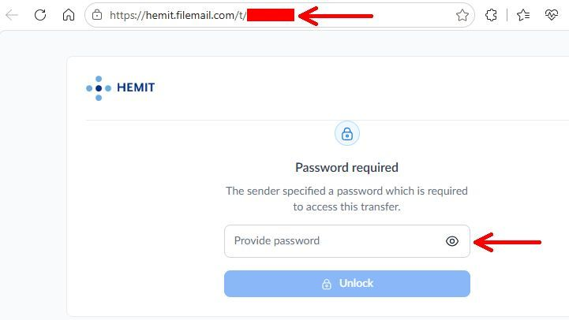
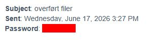
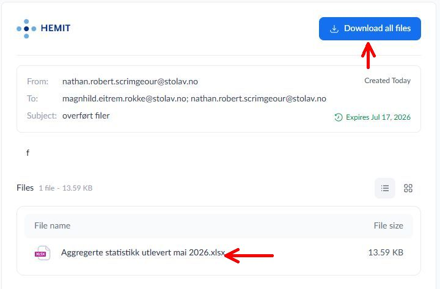

# Filemail

Filemail er en sky-basert filoverføringstjeneste, levert av selskapet Filemail som tillater brukere å 
sende store filer via internett. Filemail-nettsider er "whitelisted" i Analyserom og kan derfor brukes for å overføre filer til og fra et analyserom.

_Hvis du ikke har mottatt lenke til opplastingsportal og tilhørende passord via e-post, kan du kontakte din Helsedatasenter-rådgiver._

## Last opp filer
Du, eller datakilden din (for eksempel Helsedataservice), må åpne lenken til opplastingsportalen (`https://hemit.filemail/...`, mottatt via e-post) i en nettleser utenfor Analyserom. Når siden er lastet inn, må du skrive inn tilsendt passord og trykk på "Unlock".

---
Legg inn:

1) Helsedatasenter-rådgiverne som skal behandle filoverføringen i **"To"** feltet. Noen rådgivere skal være forhåndsvalgt som standard.
2) E-postadresse i **"Filmottakere"** feltet. Denne e-postadressen skal motta en nedlastingslenke til filen(e) som kan brukes i analyserom. 
3) En kort beskrivelse av overføringen i feltene **"Subject"** og **"Message"**, og om filen sendes til eller fra analyserommet.
4) Filene som skal overføres - enten dra og slipp filer/mapper fra filutforsker, eller trykk og velg filer/mapper.

---

Trykk på send og få bekreftelse på at filene er sendt. 

## Last ned filer
Etter en Helsedatasenter-rådgiver har håndtert overføringen, vil angitt(e) mottaker(e) motta en e-post med en passordbeskyttet lenke for å laste ned filen, og en ny e-post med tilhørende passord. Klikk på lenken. Hvis du laster ned til et analyserom, kopierer du først URL-en (`https://hemit.filemail/...`) fra en nettleser utenfor Analyserom til en nettleser i analyserommet og fortsetter prosessen der.

Skriv inn passordet som er oppgitt i den andre e-posten for å komme til nedlastingssiden.

---

Du kan deretter laste ned filene enten ved å:
- klikke på knappen «Last ned alle filer». Hvis det er flere filer i overføringen, lastes alle filene ned i et .zip-arkiv.
- klikke på hver fil individuelt

## Kryptering av personopplysninger
-  [Se veiledning for kryptering](https://github.com/Helsedatasenter-i-Midt-Norge/Oppstartsmanual/blob/main/docs/Filoverf%C3%B8ring/index.md#kryptering-av-personopplysninger)

## Husk å overføre filer til prosjektmappen
Filene lastes ned som standard til Downloads-mappen (C:/) i Analyserom, slik som på en vanlig PC. Filene må overføres til prosjektmappen (S:/). Filer i Downloads blir slettet når du logger av analyserommet. 

_Sist oppdatert: 2026-06-24_
