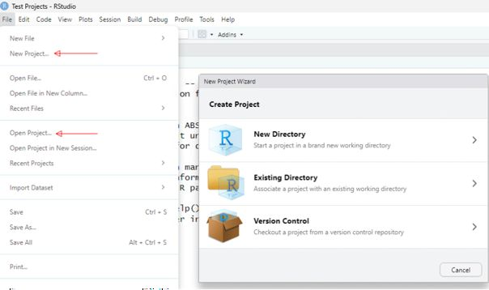
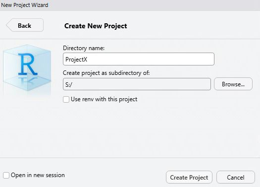
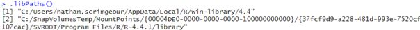
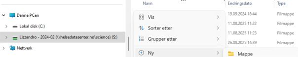
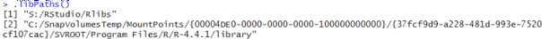
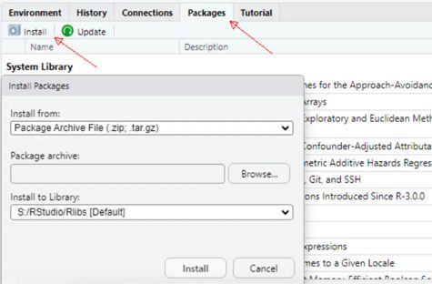
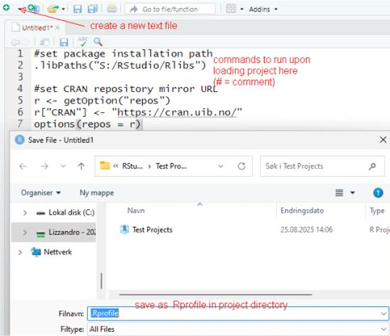

# R / RStudio

_Programmeringsspråk og programvaremiljø som brukes til statistiske beregninger og avansert datavisualisering, og integrert utviklingsmiljø (IDE) for R._

---

## Lagring av prosjekter på S:/ og installering av nye pakker fra CRAN

Filer som er lagret av brukere på analyserommets C:/ område vil av sikkerhetsmessige grunner bli slettet etter utlogging, samme som på vanlig St. Olavs PCer.  Dette betyr at ikke kun data, men også innstillinger og pakker i R slettes om man ikke endrer område for lagring. For at innstillinger og pakker i R skal gjenfinnes og gjenopprettes neste gang man logger inn må de lagres på analyserommets mappe på S:/ området. Bruk denne prosedyren for endre lagringsmappen i R.

!!! note
Merk at, i motsetning til Windows, i Rstudio må man bruke / og ikke \ i mappebaner.

### Opprett et nytt prosjekt i en mappe på S:/, eller åpne et eksisterende prosjekt lagret på S:/. 

### Sjekke .libPaths for å se hvor pakker blir installert

    .libPaths()

Tilleggspakker lastet ned av bruker lastes ned til og finnes i [1], basispakker finnes i [2]. Tilleggspakker må lagres på S:/. Tilleggspakker lagret på C:/ er ikke vedvarende til neste gang man logger inn. Derfor er det nødvendig å endre banen for pakkeinstallering.

### Endre banen for pakkeinstallering 
Opprett mappen du vil installere pakker til. Det er mulig å gjøre dette i RStudio, men for de aller fleste er det lettere å gjøre det i Windows filutforsker  

Sett pakkeinstalleringsbanen, f eks 

    .libPaths("S:/RStudio/Rlibs") 

Bekreft at [1] er satt til ønsket bane 

    .libPaths()

### Sett CRAN-speilet til å laste ned pakker fra
_Kun UIB's CRAN-speil som er whitelistet i analyserom_

    r <- getOption("repos") 
    r["CRAN"] <- "https://cran.uib.no/" 
    options(repos = r) 

### Installere pakker 
##### Alternativ 1
    install.packages("<pakkenavn>") 
Bytt ut <pakkenavn> med navn av pakken fra [denne listen](https://cran.r-project.org/web/packages/available_packages_by_name.html)

##### Alternativ 2
- Åpne Microsoft Edge i Analyserom 
- Gå til https://cran.uib.no/ 
- Last ned pakker (vanligvis Windows binary r-release) 
- Trykk på packages, install, install from package archive file

## .Rprofile. 
Hver gang prosjektet åpnes kjøres alle kommandoer i .Rprofile i prosjektmappen. Dette er en ryddig måte å kjøre samme innstillinger hver gang i prosjektet ditt og slippe å endre instillinger manuelt hver gang man logger seg inn.

## Dokumentasjon

Lenker til offisiell dokumentasjon for:
- [R](https://cran.r-project.org/)
- [RStudio](https://docs.posit.co/ide/user/)
- [CRAN package repository](https://cran.r-project.org/web/packages/available_packages_by_date.html)

_Sist oppdatert: 2026-06-18_
