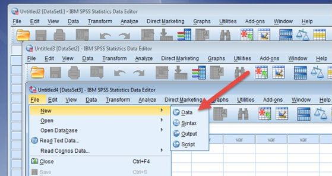

# IBM SPSS Statistics

_Programvarepakke med grafisk grensesnitt for statistiske beregninger_

---

## Lisensbruk
I Helse Midt-Norge er SPSS-lisensene fordelt ved hjelp av en egen lisensserver. Vi har totalt 40 samtidige lisenser tilgjengelig på deling mellom alle foretakene.

Man holder på en lisens for hver gang man starter ikonet. For å unngå å oppta unødige lisenser så ber vi om at dere kun starter selve programmet en gang, og deretter heller åpner flere datasett inni selve programmet.

## Dokumentasjon

Offisiell dokumentasjon og veiledning for SPSS 30 [finnes her](https://www.ibm.com/support/pages/ibm-spss-statistics-30-documentation).

_Sist oppdatert: 2026-06-18_
